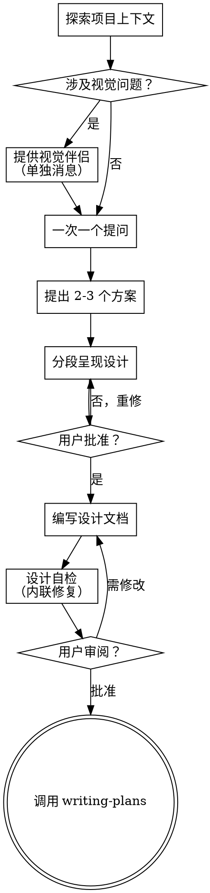

# Brainstorming Ideas Into Designs

通过自然的协作对话，将粗糙的想法打磨成完整的设计和规格说明。

先了解当前项目状态，然后一次一个地提问来细化想法。充分理解要做什么之后，呈现设计并获得用户批准。

<HARD-GATE>
在任何实现 skill、代码、脚手架、或任何实现动作之前，**必须**先呈现设计方案并获得用户批准。无论项目多简单，这条规则一律适用。
</HARD-GATE>

## 反模式："太简单了不需要设计"

每个项目都要走这个流程。待办清单、单函数工具、配置变更——全都要。"简单"项目恰恰是未经审视的假设造成最大浪费的地方。设计可以很短（真正简单的项目几句话就行），但**必须**呈现并获得批准。

## 强制检查清单

按顺序完成每一项：

1. **探索项目上下文** — 检查文件、文档、最近提交
2. **提供视觉伴侣（若主题涉及视觉问题）** — 单独发一条消息，不能夹杂在其他内容中（见下方 Visual Companion 部分）
3. **提问澄清问题** — 一次一个，理解目的/约束/成功标准
4. **提出 2-3 个方案** — 包含权衡和推荐建议
5. **分段呈现设计** — 按复杂度调整每个 section 的长度，每段获得用户批准
6. **编写设计文档** — 保存到 `docs/superpowers/specs/YYYY-MM-DD-<topic>-design.md` 并提交
7. **设计自检** — 快速检查占位符、矛盾、歧义、范围（见下方）
8. **用户审阅设计文档** — 等待用户确认后才进入下一步
9. **过渡到实现** — 调用 writing-plans skill 创建实施计划

## 流程图

**终点状态是调用 writing-plans。** brainstorming 之后**唯一**能调用的 skill 是 writing-plans。

## 详细步骤

### 理解想法

- 先检查当前项目状态（文件、文档、最近提交）
- 提问前先评估范围：如果需求涉及多个独立子系统（如"做一个平台包含聊天、文件存储、计费、分析"），立即提出。不要在需要先分解的项目上花时间细化细节。
- 项目太大无法放入单一 spec 时，帮助用户分解为子项目：有哪些独立部分？关系是什么？按什么顺序构建？然后对第一个子项目走正常设计流程。每个子项目有独立的 spec → plan → 实现循环。
- 对范围合适的项目，一次一个地提问来细化想法。优先用多选题，但也接受开放式。
- 每次消息只问一个问题。需要多角度探索时拆成多个问题。
- 聚焦于理解：目的、约束、成功标准。

### 探索方案

- 提出 2-3 个不同方案，包含权衡
- 会话式呈现选项，说明推荐理由
- 优先推荐方案放在前面并说明原因

### 呈现设计

- 确认理解需求后，呈现设计
- 每个部分的篇幅按复杂度调整：简单几句话，复杂的 200-300 字
- 每段之后询问"这样对吗"
- 覆盖：架构、组件、数据流、错误处理、测试
- 准备好在某个部分说不通时回去澄清

### 为隔离和清晰而设计

- 将系统拆分为更小的单元，每个单元有单一明确目的，通过定义清晰的接口通信
- 每个单元能独立理解和测试
- 文件应保持聚焦：一个大文件通常意味着它在做太多事情

### 在现有代码库中工作

- 提出变更前先探索当前结构，遵循已有模式
- 现有代码有问题影响工作时（如文件过大、边界不清），将改进纳入设计的一部分
- 不要提出无关的重构，聚焦于服务当前目标

## 设计之后

### 文档

- 将经过验证的设计写入 `docs/superpowers/specs/YYYY-MM-DD-<topic>-design.md`
- 提交设计文档到 git

### 设计自检

写完设计文档后，以全新视角审视：

1. **占位符扫描：** 是否有"TBD"、"TODO"、不完整部分或模糊需求？修复它们。
2. **内部一致性：** 各部分是否相互矛盾？架构描述是否与功能描述一致？
3. **范围检查：** 是否足够聚焦于单一实施计划，还是需要进一步分解？
4. **歧义检查：** 是否有需求可以被两种方式解读？如果有，选一个并明确。

内联修复，不需要重新审查。

### 用户审阅门控

审阅循环通过后，请求用户审阅书面 spec：

> "设计文档已编写并提交到 `<path>`。请审阅，如有需要修改的地方告诉我，然后我们再开始制定实施计划。"

等待用户响应。用户要求修改时，进行修改并重新进入审阅循环。只有用户批准后才能继续。

### 实施

- 调用 writing-plans skill 创建详细实施计划
- **禁止**调用其他 skill（如 frontend-design、mcp-builder）。writing-plans 是 brainstorming 之后**唯一**的下一个步骤。

## 核心原则

- **一次一个** — 不要用多个问题压垮用户
- **优先多选** — 多选比开放式更容易回答
- **彻底 YAGNI** — 从所有设计中移除不必要的功能
- **探索替代方案** — 选定之前始终提出 2-3 个方案
- **增量验证** — 呈现设计，获得批准后再推进
- **保持灵活** — 某部分说不通时回去澄清

## 视觉伴侣（Visual Companion）

一个基于浏览器的伴侣工具，用于在 brainstorming 期间展示原型、图表和视觉选项。作为工具使用，不是一种模式。

**提供伴侣：** 当预判接下来的问题涉及视觉内容（原型、布局、图表）时，提供一次同意：

> "我们正在做的一些内容如果能用浏览器展示可能更容易解释。我可以制作原型、图表、比较图和其他视觉内容作为我们讨论的辅助。这功能还很新，会消耗较多 token。要试试吗？（需要打开一个本地 URL）"

**这条提供必须单独发一条消息。** 不能与澄清问题、上下文摘要或其他任何内容合并。等待用户响应后再继续。如果用户拒绝，用纯文本继续 brainstorming。

**逐问题决策：** 即使用户同意了，每次仍需判断是使用浏览器还是终端。判断标准：**用户看图比读文字理解得更好吗？**

- **用浏览器** 处理本质是视觉的内容 — 原型、线框图、布局比较、架构图、方案并排对比
- **用终端** 处理文本内容 — 需求问题、概念选择、权衡列表、A/B/C/D 文本选项、范围决策

关于 UI 的问题不一定是视觉问题。"这个'个性'在这个语境下意味着什么？"是概念问题，用终端。"哪种向导布局效果更好？"是视觉问题，用浏览器。
